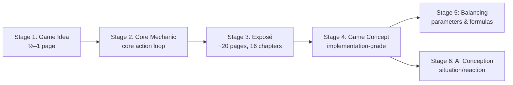

# Game Ideation AI Agent Skills

[](https://agentskills.io/specification/)
[](https://skills.sh/)

A structured, AI-agent-supported workflow that takes a raw game idea through to a complete, implementation-grade Game Concept — guided by the methodology of Daniel Dumont's six-part workshop *"Von der Idee zum Konzept"* (Making Games Magazin, 2010–2011).

## What this skill set does

Game design documentation tends to fail in one of two ways: either it stays a vague pitch that nobody can build from, or it grows into a sprawling document that nobody can read. Dumont's method solves both by **walking the author through three stages of increasing detail**, with explicit gates between stages and discipline rules that keep each stage focused.

This repository turns that method into a set of AI agent skills. Each skill:

- Acts as an **experienced co-designer** — not a passive scribe, but an active partner that questions weak points, surfaces design risks, and contributes creative impulses
- Knows its **stage's rules** (length limits, required components, anti-patterns) from the Dumont workshop summaries
- Maintains **continuity** across stages — earlier decisions are respected and inherited by later stages
- Captures **out-of-stage details** in side-notes so nothing is lost when the author drills into something prematurely

The result: a coherent set of design documents that grow from a half-page vision into a full implementation-ready concept, without the author losing the overview at any point.

## A word on the methodology

Dumont's workshop is from 2010/2011 — methodologically rooted in the era of classic waterfall planning that German studios like Ascaron (Dumont's home) practiced at the time. We use it deliberately, with eyes open.

**What is timeless:**

| Element                                                              | Why it stays valid                           |
|----------------------------------------------------------------------|----------------------------------------------|
| **Vision → Exposé → Concept staging**                                | Mirrors any structured design work           |
| Precision discipline                                                 | Every gap in the spec costs time later       |
| Change management as a practice                                      | Untracked decisions always come back to bite |
| Feature chapters covering edge cases, dependencies, balancing values | The questions you skip are the bugs you ship |

**What feels 2010s-era:**

| Element                                                                     | Why it's dated                                       |
|-----------------------------------------------------------------------------|------------------------------------------------------|
| Strongly waterfall: *"design completely first, then build"*                 | Modern practice ships earlier and iterates           |
| Implicit assumption of a full team (producer, QA, dedicated concept author) | Assumes infrastructure most solo devs lack           |
| Paper-design over prototyping                                               | Today's vertical-slice-first approach is more common |
| No mention of living docs, wikis, modern tooling                            | Modern teams use Notion, Confluence, and similar     |

**Why this fits AI-assisted solo development:**

Modern indie and AAA practice is heavily prototype-driven — vertical slice first, write the spec afterward. That works when you have a team carrying verbal decisions around. **Solo developers working with AI assistance are in a different situation:** there is no team to absorb undocumented decisions, and the AI agent's output quality is bounded by the precision of its input.

Dumont's strictness — write it down, write it precisely, gate each stage — turns out to be a much better match for this case than modern-agile practice. Documentation is the solo developer's memory. It is also the AI agent's input contract.

## How it works — the three-stage flow

Dumont's core insight is **three stages of conception**, each gated by review and viability:



**Stage-gate rule:** never advance until the current stage has been discussed, ambiguities resolved, and content is viable on current knowledge.

**Detail discipline:** anything that belongs to a later stage gets parked in a per-document `*_notes.md` sidecar file. Later-stage skills pick those notes up when they get there.

### Stages, documents, and skills

| Stage            | Document(s) produced                                                                            | Skill                                        | Status      |
|------------------|-------------------------------------------------------------------------------------------------|----------------------------------------------|-------------|
| Foundation       | folder scaffold + templates                                                                     | [`init-game-docs`](skills/init-game-docs/)   | ✅ available |
| 1. Game Idea     | `01_GameIdea.md` + notes sidecar                                                                | [`write-game-idea`](skills/write-game-idea/) | ✅ available |
| 2. Core Mechanic | `02_CoreMechanic.md`                                                                            | `write-core-mechanic`                        | 🔜 planned  |
| 3. Exposé        | `03_Exposé.md`                                                                                  | `write-expose`                               | 🔜 planned  |
| 4. Game Concept  | `04_GameConcept.md`, `05_FunctionalDesign.md`, `06_LogicalConcept.md`, `07_InterfaceConcept.md` | `write-game-concept`                         | 🔜 planned  |
| 5. Balancing     | `08_BalancingAndParameters.md`                                                                  | `write-balancing`                            | 🔜 planned  |
| 6. AI Conception | extends Logical Concept                                                                         | `write-ai-conception`                        | 🔜 planned  |
| Cross-cutting    | `09_ChangeLog.md`                                                                               | (manual / part of every skill)               | —           |

### Dependency model

`init-game-docs` is the **foundation skill**. It scaffolds the folder structure and owns the shared workshop reference files in its `references/` folder. All stage skills read those references via relative paths (`../init-game-docs/references/...`). Installing a stage skill without `init-game-docs` will leave its references broken — install the foundation first.

## Install

### Claude Code (plugin)

Inside Claude Code, add the marketplace, then install the plugin:

```
/plugin marketplace add chrtmnn/game-ideation
/plugin install game-ideation@chrtmnn-game-ideation
```

Both skills (`init-game-docs`, `write-game-idea`) come bundled in the plugin. Invoke them as `/game-ideation:init-game-docs` and `/game-ideation:write-game-idea` once installed.

### skills.sh (cross-agent CLI)

For any agent that follows the [agentskills.io](https://agentskills.io/specification) spec (Cursor, Codex, Copilot, Gemini CLI, Claude Code):

```bash
npx skills add chrtmnn/game-ideation
```

List available skills:

```bash
npx skills add chrtmnn/game-ideation --list
```

---

## Dumont Workshop — Background Knowledge for AI Agent Skills

Detailed English summaries of Daniel Dumont's six-part workshop *"Von der Idee zum Konzept"* (Making Games Magazin 03/2010–02/2011). These summaries serve as **background knowledge** for the skills in this repository that support each step of the methodology.

### Files

| File                  | Workshop Part                                | *Making Games Magazin* Issue                                                                                                                                           | Skill Use Case                                                                     |
|-----------------------|----------------------------------------------|------------------------------------------------------------------------------------------------------------------------------------------------------------------------|------------------------------------------------------------------------------------|
| `00_glossary.md`      | —                                            | —                                                                                                                                                                      | German ↔ English terminology authority for all summaries                           |
| `01_game-idea.md`     | Part 1 — The Game Idea                       | [03/2010, p. 34 ff.](https://s3-eu-west-1.amazonaws.com/editor.production.pressmatrix.com/emags/210227/pdfs/original/07eb014b-5a50-49ec-8018-6a7fffdcf816.pdf#page=34) | Skills supporting the initial vision document (`01_GameIdea.md`)                   |
| `02_core-mechanic.md` | Part 2 — The Core Mechanic                   | [04/2010, p. 40 ff.](https://s3-eu-west-1.amazonaws.com/editor.production.pressmatrix.com/emags/210226/pdfs/original/fe7c682f-9785-47da-8b60-e3484679ed41.pdf#page=40) | Skills sharpening the core action loop (`02_CoreMechanic.md`)                      |
| `03_expose.md`        | Part 3 — The Exposé                          | [05/2010, p. 44 ff.](https://s3-eu-west-1.amazonaws.com/editor.production.pressmatrix.com/emags/210225/pdfs/original/7be33df1-cee5-47e2-9afd-5354a042b14f.pdf#page=44) | Skills producing the 16-chapter Exposé (`03_Exposé.md`)                            |
| `04_concept.md`       | Part 4 — The Game Concept                    | [06/2010, p. 38 ff.](https://s3-eu-west-1.amazonaws.com/editor.production.pressmatrix.com/emags/210224/pdfs/original/d756bb5c-e862-4701-af23-5ffc358bf467.pdf#page=38) | Skills writing or reviewing the full Game Concept (`04_GameConcept.md` and onward) |
| `05_balancing.md`     | Part 5 — Early Balancing & Extreme Balancing | [01/2011, p. 32 ff.](https://s3-eu-west-1.amazonaws.com/editor.production.pressmatrix.com/emags/210223/pdfs/original/149809aa-25af-459a-bded-6b588aa5842c.pdf#page=32) | Skills supporting balancing in the concept phase (`08_BalancingAndParameters.md`)  |
| `06_ai-conception.md` | Part 6 — AI Conception                       | [02/2011, p. 30 ff.](https://s3-eu-west-1.amazonaws.com/editor.production.pressmatrix.com/emags/210222/pdfs/original/818b03e0-5955-41ab-a515-c9ab778fac1e.pdf#page=30) | Skills designing or documenting AI behavior                                        |

### How skills should consume these files

- These files are **not skill instructions**. They are reference material that a skill loads or links to in its own instructions.
- The files are written for AI-agent consumption: dense tables, decision matrices, anti-pattern lists, diagnostic moves. Not optimized for human prose reading.
- Each summary starts with a **TL;DR** (one-paragraph state-of-the-world) followed by an **Agent Cheat Sheet** section — the cheat sheet is the operating rules block, directly usable as skill behavior guidance.
- Worked examples (Darkstar One, Patrizier 4, Fallout 3, Sacred 2) preserved verbatim as factual references.
- The glossary (`00_glossary.md`) is the single source of truth for terminology choices. Skills should defer to it when translating user input.

### Source provenance

- Markdown `Von_der_Idee_zum_Konzept.md` (held outside this repo, transcription from magazine PDF files)
- Author: Daniel Dumont, co-founder & Creative Director, Gaming Minds Studios
- Publication: Making Games Magazin, six-part series 03/2010 - 02/2011

### Formatting conventions

- Headings: flat hierarchy (max 3 levels).
- **Tables preferred over prose** for any comparable data (rules, anti-patterns, decision matrices).
- German source terms appear in parentheses next to their English translation on first occurrence per file.
- Worked examples preserve Dumont's original games verbatim (Darkstar One, Patrizier 4, Fallout 3, Sacred 2, etc.).
- Per-file structure: `TL;DR → Agent Cheat Sheet → Worked Examples → Cross-references`.
