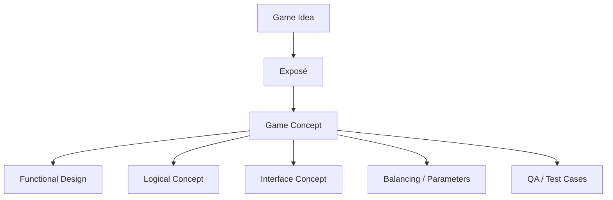

# Game Concept Templates after Daniel Dumont, article series "Von der Idee zum Konzept", Making Games Magazin 03/2010–02/2011

## 1. Key Takeaways from the Workshop "Von der Idee zum Konzept"

- Conception runs in **three stages**: **Game Idea**, **Exposé**, **Game Concept**. Only when a stage is complete,
  reviewed, and viable do you move on to the next.
- The **Exposé** is the most important efficient intermediate document: it covers the overall vision concisely, but from
  every relevant perspective.
- The **Game Concept** is the detailed, continuously maintained final version of the design documentation. It should
  anticipate implementation as precisely as possible.
- The author should always secure the **broad vision** first and only then drill into the details.
- Particularly important within the concept: **detailed design**, **change management**, **interface concept**,
  **balancing/parameters**, **QA-grade level of detail**.



## 2. Which documents are needed or created during the concept phase?

### Mandatory documents / primary artifacts

1. **Game Idea**
2. **Core Mechanic**
3. **Exposé**
4. **Game Concept**
    - usually meaningfully split into:
        - **Functional Design**
        - **Logical Concept**

### Important supporting documents

- **Interface Concept**
- **Balancing / Parameters document**
- **Change log / version history**
- **Graphics / asset list**
- **Technology / middleware overview**
- **Task / chapter overview for implementation and QA**
- **Test case foundations** (derived from the concept)

# 3. Quick Templates for All Document Types

> Format: Markdown.  
> Please replace placeholders in `{{...}}`.

## 3.1 `01_GameIdea.md`

```markdown
# Game Idea

## Target Picture in 3–5 Sentences

- What is the core vision?
- What should the reader picture immediately?

## Genre

- Which genre does the game belong to?
- Is it a genre mix? Which references help classify it?

## Plot / Setting / Theme

- What is the setting of the game?
- Which backstory or theme carries the vision?
- Is there a story that unfolds throughout the game?
- What mood should be created?

## Core Mechanic in One Sentence

- What is the recurring core action?
- What generates the actual fun?

## Appeal / Wow Factor

- What is appealing at first glance?
- What makes the game visually or thematically attractive?

## USPs in Short Form

- What sets the game apart from the competition in 1–3 points?

## Out of Scope / Boundaries

- What is explicitly not part of the game idea?
- What will only be clarified later in the Exposé or Game Concept?

## Open Points

- Which assumptions are still uncertain?
- Which questions must be answered before the next step?
```

## 3.2 `02_CoreMechanic.md`

```markdown
# Core Mechanic

## Short Definition

- Which central action loop generates the core fun?

## Mechanic Description

- What does the player do over and over again?
- Which psychological motivation is being addressed?
- Why is it motivating?

## Features That Carry the Mechanic

| Feature | Contribution to the Mechanic | Risk / Dependency |
|---|---|---|
| {{Feature 1}} | {{Contribution}} | {{Risk}} |
| {{Feature 2}} | {{Contribution}} | {{Risk}} |

## What Does Not Belong to the Mechanic?

- Which elements are only atmosphere or extras?
- Which features can be cut without destroying the core?

## Fine-Tuning / Balancing Notes

- Which parameters influence the mechanic?
- Where is there a risk of over- or under-challenging the player?
- Which values will need to be calculated or balanced later?

## Open Questions

- Is the core mechanic understandable and playable?
- Are all related features cleanly aligned with each other?
```

## 3.3 `03_Exposé.md`

```markdown
# Exposé

## Purpose

- Concise, efficient overall picture of the game vision
- Basis for development, alignment, and, if applicable, the publisher pitch

## 1. Idea & Vision Statement

- What is the vision in a compact paragraph?
- What fundamentally defines the game?
- How do the game idea and the core mechanic connect?

## 2. USPs

- What are the three most important reasons the game stands out?
- What is genuinely surprising, memorable, and communicable?
- Which USPs are not just standard expectations?

## 3. Player Tasks

- What does the player concretely engage with?
- Are there multiple gameplay layers?
- How is playtime distributed across the tasks?
- Where could boredom set in?

## 4. Gameplay Example

- Describe 60 seconds of a typical core gameplay situation.
- What does the player see?
- How does the camera move?
- What does the player hear?
- Which decision does the player make, and why?

## 5. Visual Presentation

- Which setting and which style?
- How appealing is the main character?
- Which atmosphere should the game world evoke?
- Which effects, camera moves, or staged moments are planned?

## 6. Core Features

- Which features are indispensable?
- Which features form the main mechanic?
- Which reward systems are mandatory?

## 7. Additional Features

- Which features enhance atmosphere or scope?
- What is "nice to have" and could be cut if needed?
- Which elements make the project scalable?

## 8. Interface

- What does the player see and control?
- How are HUD, controls, and camera envisioned?
- Which menus, screens, and input conventions exist?
- What level of control complexity is still manageable?

## 9. Game World and Story

- How is the world structured?
- Which story is being told?
- Which factions, locations, conflicts, or rules shape the world?

## 10. Game Structure

- How is the game divided into segments, modes, missions, or phases?
- How does the structure evolve over time?

## 11. List of All Game Modes

- Which modes exist?
- Which are mandatory, which are optional?

## 12. Target Audience and Platforms

- Who is the game aimed at?
- On which platforms is it intended to ship?
- Which requirements follow from that?

## 13. Critical Points

- Which risks are known?
- Which assumptions could fail?
- Which weaknesses must be resolved before project start?

## 14. Team Size and Structure

- Who will be needed?
- Which roles are critical?
- Which team structure fits the scope?

## 15. Tools and Middleware

- Which tools, engines, or middleware will be used?
- Which technical foundation is assumed?

## 16. Development Timeframe

- How long will development take?
- Which milestones are planned?
- Which dependencies drive the schedule?

## Closing Questions

- Is the vision consistent across all pages?
- Are the weaknesses visible?
- Is the document concise, clear, and internally usable?
```

## 3.4 `04_GameConcept.md`

```markdown
# Game Concept

## Purpose

- Detailed, implementation-oriented description of the game
- Continuously maintained guardrail for design, implementation, and QA

## Document Principles

- Always keep up to date
- Document changes in context
- Write precisely enough to leave little room for interpretation
- Only go into depth once the rough structure is in place

## Coarse Structure of the Concept

- Functional Design
- Logical Concept
- Interface Concept
- Balancing / Parameters
- Change Management
- Appendices / tables / diagrams

## Chapter Template for Each Feature / System

### 1. Goal of the Feature

- Which problem does the feature solve?
- What is its benefit to the game?

### 2. Player Impact

- What should the player feel, understand, or do?

### 3. Rules

- Which rules apply?
- Which states, exceptions, or limits exist?

### 4. Flow

- How does the feature unfold step by step?
- Which triggers, inputs, and reactions exist?

### 5. Data / Parameters

- Which values are relevant?
- Which formulas or calculations are required?

### 6. Dependencies

- What does the feature depend on?
- Which other systems are affected?

### 7. Special Cases

- Which edge cases need to be described?

### 8. Balancing

- Which tuning knobs exist?
- Which target values are intended?

### 9. UI / Feedback

- How is the feature made visible?
- What does the player see / hear / understand?

### 10. Implementation Notes

- What must the implementation absolutely take into account?
- What is still open?

## Final Review

- Is every feature described precisely enough?
- Are there any unclear passages?
- Are all relevant special cases captured?
```

## 3.5 `05_FunctionalDesign.md`

```markdown
# Functional Design

## Goal

- Describes what the player sees and can do

## Visible Gameplay Flows

- Which actions are possible?
- Which states does the player see?
- Which feedback does the player receive?

## Controls

- Which inputs exist?
- How do navigation, selection, confirmation, and cancellation work?

## Screens / Modes / Menus

- Which screens exist?
- Which information and actions are available there?

## Gameplay Loops

- Which visible loops exist?
- How do gameplay actions repeat?

## Open Questions

- Is every visible flow understandable?
- Are the controls intuitive?
```

## 3.6 `06_LogicalConcept.md`

```markdown
# Logical Concept

## Goal

- Describes what happens inside the game

## System Logic

- Which internal rules apply?
- Which calculations, triggers, and state changes exist?

## Data Models

- Which entities, values, and relationships are relevant?

## State Models

- Which states can an object / player / system have?
- How does it transition between states?

## Dependencies

- Which systems influence each other?
- Where do chain reactions occur?

## Special Cases and Edge Cases

- What happens with exceptions?
- Which conflicts are possible?

## Balancing / Formulas

- Which parameters are calculated?
- Which formulas drive them?

## Open Questions

- Is the logic complete and free of contradictions?
- Are all state transitions documented?
```

## 3.7 `07_InterfaceConcept.md`

```markdown
# Interface Concept

## Goal

- Simple, intuitive interface for a complex game logic

## HUD / Screen Layout

- Which elements are permanently visible?
- Where is which information placed?

## Controls

- Which keys / buttons / inputs exist?
- What is the default mapping?

## Camera

- How is the camera controlled?
- Are there any special cases or specialty cameras?

## Menus and Screens

- Which screens exist?
- Which actions are available there?

## Interaction

- How does the player interact with the world, objects, and NPCs?
- Which physical or context-dependent interactions exist?

## Usability Risks

- Where does the interface become too complex?
- Where does information need to be reduced or consolidated?

## Sketch / Wireframe

- Insert a simple schematic representation of the most important screens

## Open Questions

- Is the interface compatible with the game's complexity?
- Is anything missing that the player constantly needs?
```

## 3.8 `08_BalancingAndParameters.md`

```markdown
# Balancing and Parameters Document

## Goal

- Early description and assessment of values, formulas, and relationships

## Parameter Overview

| Parameter | Meaning | Target Value / Range | Dependencies |
|---|---|---|---|
| {{Parameter 1}} | {{Meaning}} | {{Value}} | {{Dependencies}} |

## Formulas

- Which formulas are used?
- Which values influence the result?

## Test Assumptions

- Which values seem plausible?
- Which values need to be simulated?

## Risk Analysis

- Which parameters are critical?
- What happens at extreme values?

## Alignment with Design Goal

- Does the balancing support the intended player experience?
- Does it lead to frustration, boredom, or exploits?

## Open Points

- Which values need to be validated in prototypes or tests?
```

## 3.9 `09_ChangeLog.md`

```markdown
# Change Log

## Purpose

- Traceable maintenance of the concept during development

## Rule

- Changes are documented first, then implemented
- Each change remains visible in the context of the concept

## Entry per Change

| Date | Area | Change | Reason | Impact | Status |
|---|---|---|---|---|---|
| {{Date}} | {{Area}} | {{Change}} | {{Reason}} | {{Impact}} | {{Status}} |

## Open Questions

- Has the change already been incorporated into the concept?
- Does it need to be mirrored in other documents?
```

# 4. Quick Working Order

1. Write the **Game Idea**.
2. Sharpen the **Core Mechanic**.
3. Fill out the **Exposé**.
4. Derive the **Game Concept** from the Exposé.
5. Break the Game Concept down into **Functional Design** and **Logical Concept**.
6. Maintain **Interface**, **Balancing**, and **Change Log** in parallel.

# 5. Practical Short Rule from the Workshop

- Secure **breadth** first, then **depth**.
- Don't latch onto individual features too early.
- Critically question anything that doesn't hang on the core mechanic.
- In the end, the Game Concept should be complete enough for implementation, feedback, and QA to work with.
