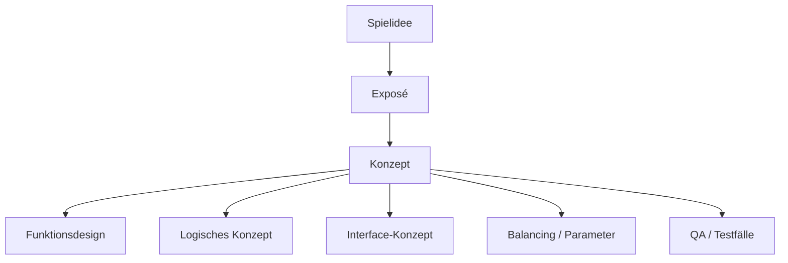

# Spielkonzept-Templates nach Daniel Dumont, Artikelreihe „Von der Idee zum Konzept“, Making Games Magazin 03/2010-02/2011

## 1. Wesentliche Kernpunkte des Workshops „Von der Idee zum Konzept“

- Die Konzeption läuft in **drei Etappen**: **Spielidee**, **Exposé**, **Konzept**. Erst wenn eine Etappe abgeschlossen,
  besprochen und tragfähig ist, geht man zur nächsten über.
- Das **Exposé** ist das wichtigste effiziente Zwischendokument: Es behandelt die Gesamtvision knapp, aber in allen
  relevanten Perspektiven.
- Das **Konzept** ist die ausführliche, laufend gepflegte Endfassung der Designdokumentation. Es soll die Umsetzung
  möglichst präzise vorwegnehmen.
- Der Autor soll immer zuerst die **breite Vision** sichern und erst danach in die Tiefe gehen.
- Im Konzept sind besonders wichtig: **Feinkonzeption**, **Änderungsmanagement**, **Interface-Konzept**, *
  *Balancing/Parameter**, **QA-taugliche Detaillierung**.



## 2. Welche Dokumente werden für die Konzeptphase benötigt bzw. erstellt?

### Pflichtdokumente / Hauptartefakte

1. **Spielidee**
2. **Spielmechanismus**
3. **Exposé**
4. **Spielkonzept**
    - meist sinnvoll unterteilt in:
        - **Funktionsdesign**
        - **Logisches Konzept**

### Wichtige Begleitdokumente / Unterlagen

- **Interface-Konzept**
- **Balancing-/Parameterdokument**
- **Änderungsliste / Versionshistorie**
- **Grafik-/Asset-Liste**
- **Technik-/Middleware-Übersicht**
- **Task-/Kapitelübersicht für Umsetzung und QA**
- **Testfallgrundlagen** (aus dem Konzept abgeleitet)

---

# 3. Schnell-Templates für alle Dokumenttypen

> Format: Markdown.  
> Platzhalter in `{{...}}` bitte ersetzen.

## 3.1 `01_Spielidee.md`

```md
# Spielidee

## Zielbild in 3–5 Sätzen

- Was ist die Grundvision?
- Was soll der Leser sofort vor sich sehen?

## Genre

- In welchem Genre liegt das Spiel?
- Ist es ein Genre-Mix? Welche Referenzen helfen beim Einordnen?

## Plot / Setting / Thema

- Welches Setting hat das Spiel?
- Welche Hintergrundgeschichte oder welches Thema trägt die Vision?
- Gibt es eine Story, die sich im Spielverlauf entwickelt?
- Welche Stimmung soll entstehen?

## Spielmechanismus in einem Satz

- Was ist die wiederkehrende Kernaktion?
- Was erzeugt den eigentlichen Spaß?

## Attraktivität / Wow-Effekt

- Was ist auf den ersten Blick attraktiv?
- Wodurch ist das Spiel visuell oder thematisch anziehend?

## USPs in Kurzform

- Was unterscheidet das Spiel in 1–3 Punkten von der Konkurrenz?

## Nicht im Fokus / Abgrenzung

- Was gehört ausdrücklich nicht zur Spielidee?
- Was wird erst später im Exposé oder Konzept geklärt?

## Offene Punkte

- Welche Annahmen sind noch unsicher?
- Welche Fragen müssen vor dem nächsten Schritt beantwortet werden?
```

## 3.2 `02_Spielmechanismus.md`

```md
# Spielmechanismus

## Kurzdefinition

- Welcher zentrale Aktionsablauf erzeugt den Kernspaß?

## Mechanismus-Beschreibung

- Was macht der Spieler immer wieder?
- Welche psychologische Motivation wird angesprochen?
- Warum ist das motivierend?

## Features, die den Mechanismus tragen

| Feature | Beitrag zum Mechanismus | Risiko / Abhängigkeit |
|---|---|---|
| {{Feature 1}} | {{Beitrag}} | {{Risiko}} |
| {{Feature 2}} | {{Beitrag}} | {{Risiko}} |

## Was gehört nicht zum Mechanismus?

- Welche Elemente sind nur Atmosphäre oder Zusatz?
- Welche Features können gestrichen werden, ohne den Kern zu zerstören?

## Feintuning / Balancing-Hinweise

- Welche Parameter beeinflussen den Mechanismus?
- Wo drohen Über- oder Unterforderung?
- Welche Werte müssen später berechnet oder gebalanced werden?

## Offene Fragen

- Ist der Kernmechanismus verständlich und spielbar?
- Sind alle zugehörigen Features sauber aufeinander abgestimmt?
```

## 3.3 `03_Expose.md`

```md
# Exposé

## Zweck

- Knappes, effizientes Gesamtbild der Spielvision
- Basis für Entwicklung, Abstimmung und ggf. Publisher-Pitch

## 1. Idee & Vision Statement

- Was ist die Vision in einem kompakten Absatz?
- Was macht das Spiel grundsätzlich aus?
- Wie hängen Spielidee und Mechanismus zusammen?

## 2. USPs

- Was sind die drei wichtigsten Gründe, warum das Spiel heraussticht?
- Was ist wirklich überraschend, merkfähig und kommunizierbar?
- Welche USPs sind nicht bloß Standarderwartungen?

## 3. Aufgaben des Spielers

- Womit beschäftigt sich der Spieler konkret?
- Gibt es mehrere Spielebenen?
- Wie verteilt sich die Spielzeit auf die Aufgaben?
- Wo könnte Langeweile entstehen?

## 4. Gameplay-Beispiel

- Beschreibe 60 Sekunden einer typischen Kernspielsituation.
- Was sieht der Spieler?
- Wie bewegt sich die Kamera?
- Was hört der Spieler?
- Welche Entscheidung trifft der Spieler und warum?

## 5. Visuelle Präsentation

- Welches Setting und welcher Stil?
- Wie attraktiv ist der Hauptcharakter?
- Welche Atmosphäre soll die Spielwelt erzeugen?
- Welche Effekte, Kamerafahrten oder Inszenierungen sind geplant?

## 6. Kernfeatures

- Welche Features sind unerlässlich?
- Welche Features bilden den Hauptmechanismus?
- Welche Reward-Systeme sind Pflicht?

## 7. Weitere Features

- Welche Features verbessern Atmosphäre oder Umfang?
- Was ist „nice to have“ und im Zweifel streichbar?
- Welche Elemente machen das Projekt skalierbar?

## 8. Interface

- Was sieht und steuert der Spieler?
- Wie ist HUD, Steuerung und Kamera gedacht?
- Welche Menüs, Screens und Eingabekonventionen gibt es?
- Welche Bedienungskomplexität ist noch beherrschbar?

## 9. Spielwelt und Story

- Wie ist die Welt aufgebaut?
- Welche Story wird erzählt?
- Welche Fraktionen, Orte, Konflikte oder Regeln prägen die Welt?

## 10. Spielstruktur

- Wie ist das Spiel in Abschnitte, Modi, Missionen oder Phasen gegliedert?
- Wie entwickelt sich die Struktur über die Zeit?

## 11. Liste aller Spielmodi

- Welche Modi existieren?
- Welche sind Pflicht, welche optional?

## 12. Zielgruppe und Plattformen

- Für wen ist das Spiel gedacht?
- Auf welchen Plattformen soll es erscheinen?
- Welche Anforderungen folgen daraus?

## 13. Kritische Punkte

- Welche Risiken sind bekannt?
- Welche Annahmen könnten scheitern?
- Welche Schwachstellen müssen vor Projektstart gelöst werden?

## 14. Teamgröße und Struktur

- Wer wird benötigt?
- Welche Rollen sind kritisch?
- Welche Teamstruktur passt zum Umfang?

## 15. Tools und Middleware

- Welche Tools, Engines oder Middleware werden verwendet?
- Welche technische Basis wird vorausgesetzt?

## 16. Entwicklungszeitrahmen

- Wie lange dauert die Entwicklung?
- Welche Meilensteine sind geplant?
- Welche Abhängigkeiten bestimmen den Zeitplan?

## Abschlussfragen

- Ist die Vision über alle Seiten konsistent?
- Sind die Schwachstellen sichtbar?
- Ist das Dokument knapp, klar und intern nutzbar?
```

## 3.4 `04_Konzept.md`

```md
# Spielkonzept

## Zweck

- Detaillierte, umsetzungsnahe Beschreibung des Spiels
- Laufend gepflegte Leitplanke für Design, Umsetzung und QA

## Dokumentprinzipien

- Immer aktuell halten
- Änderungen im Kontext dokumentieren
- So präzise schreiben, dass wenig Interpretationsspielraum bleibt
- Erst in die Tiefe gehen, wenn die grobe Struktur steht

## Grobstruktur des Konzepts

- Funktionsdesign
- Logisches Konzept
- Interface-Konzept
- Balancing / Parameter
- Änderungsmanagement
- Anhänge / Tabellen / Diagramme

## Kapitel-Template für jedes Feature / System

### 1. Ziel des Features

- Welches Problem löst das Feature?
- Welchen Nutzen hat es für das Spiel?

### 2. Spielerwirkung

- Was soll der Spieler fühlen, verstehen oder tun?

### 3. Regelwerk

- Welche Regeln gelten?
- Welche Zustände, Ausnahmen oder Grenzen gibt es?

### 4. Ablauf

- Wie läuft das Feature Schritt für Schritt ab?
- Welche Trigger, Eingaben und Reaktionen gibt es?

### 5. Daten / Parameter

- Welche Werte sind relevant?
- Welche Formeln oder Berechnungen werden benötigt?

### 6. Abhängigkeiten

- Wovon hängt das Feature ab?
- Welche anderen Systeme sind betroffen?

### 7. Sonderfälle

- Welche Edge Cases müssen beschrieben werden?

### 8. Balancing

- Welche Stellschrauben gibt es?
- Welche Zielwerte sind vorgesehen?

### 9. UI / Feedback

- Wie wird das Feature sichtbar?
- Was sieht/hört/versteht der Spieler?

### 10. Umsetzungsnotizen

- Was muss die Implementierung unbedingt beachten?
- Was ist noch offen?

## Abschlussprüfung

- Ist jedes Feature präzise genug beschrieben?
- Gibt es unklare Stellen?
- Sind alle relevanten Sonderfälle erfasst?
```

## 3.5 `05_Funktionsdesign.md`

```md
# Funktionsdesign

## Ziel

- Beschreibt, was der Spieler sieht und tun kann

## Sichtbare Spielabläufe

- Welche Aktionen sind möglich?
- Welche Zustände sieht der Spieler?
- Welche Rückmeldungen erhält er?

## Bedienung

- Welche Eingaben gibt es?
- Wie funktioniert Navigation, Auswahl, Bestätigung, Abbruch?

## Screens / Modi / Menüs

- Welche Screens existieren?
- Welche Informationen und Aktionen sind dort verfügbar?

## Spielschleifen

- Welche sichtbaren Schleifen gibt es?
- Wie wiederholen sich Spielhandlungen?

## Offene Fragen

- Ist jeder sichtbare Ablauf verständlich?
- Ist die Bedienung intuitiv?
```

## 3.6 `06_Logisches_Konzept.md`

```md
# Logisches Konzept

## Ziel

- Beschreibt, was im Inneren des Spiels passiert

## Systemlogik

- Welche internen Regeln gelten?
- Welche Berechnungen, Trigger und Zustandswechsel gibt es?

## Datenmodelle

- Welche Entitäten, Werte und Beziehungen sind relevant?

## Zustandsmodelle

- Welche Zustände kann ein Objekt / Spieler / System haben?
- Wie wechselt es zwischen Zuständen?

## Abhängigkeiten

- Welche Systeme beeinflussen sich gegenseitig?
- Wo entstehen Kettenreaktionen?

## Sonderfälle und Edge Cases

- Was passiert bei Ausnahmen?
- Welche Konflikte sind möglich?

## Balancing / Formeln

- Welche Parameter werden berechnet?
- Welche Formeln stehen dahinter?

## Offene Fragen

- Ist die Logik vollständig und widerspruchsfrei?
- Sind alle Zustandswechsel dokumentiert?
```

## 3.7 `07_Interface-Konzept.md`

```md
# Interface-Konzept

## Ziel

- Einfaches, intuitives Interface für eine komplexe Spiellogik

## HUD / Bildschirmaufbau

- Welche Elemente sind dauerhaft sichtbar?
- Wo liegen welche Informationen?

## Steuerung

- Welche Tasten / Buttons / Eingaben gibt es?
- Was ist die Standardbelegung?

## Kamera

- Wie wird die Kamera gesteuert?
- Gibt es Sonderfälle oder Spezialkameras?

## Menüs und Screens

- Welche Screens existieren?
- Welche Aktionen sind dort möglich?

## Interaktion

- Wie interagiert der Spieler mit Welt, Objekten und NPCs?
- Welche physikalischen oder kontextabhängigen Interaktionen gibt es?

## Usability-Risiken

- Wo wird das Interface zu komplex?
- Wo müssen Informationen reduziert oder zusammengefasst werden?

## Skizze / Wireframe

- Einfache schematische Darstellung der wichtigsten Screens einfügen

## Offene Fragen

- Ist das Interface mit der Komplexität des Spiels vereinbar?
- Fehlt etwas, das der Spieler ständig braucht?
```

## 3.8 `08_Balancing-und-Parameter.md`

```md
# Balancing- und Parameterdokument

## Ziel

- Frühzeitige Beschreibung und Bewertung von Werten, Formeln und Zusammenhängen

## Parameterübersicht

| Parameter | Bedeutung | Zielwert / Bereich | Abhängigkeiten |
|---|---|---|---|
| {{Parameter 1}} | {{Bedeutung}} | {{Wert}} | {{Abhängigkeiten}} |

## Formeln

- Welche Formeln werden verwendet?
- Welche Werte beeinflussen das Ergebnis?

## Testannahmen

- Welche Werte erscheinen plausibel?
- Welche Werte müssen simuliert werden?

## Risikoanalyse

- Welche Parameter sind kritisch?
- Was passiert bei Extremwerten?

## Abgleich mit Designziel

- Unterstützt das Balancing die gewünschte Spielerfahrung?
- Führt es zu Frust, Langeweile oder Exploits?

## Offene Punkte

- Welche Werte müssen in Prototypen oder Tests validiert werden?
```

## 3.9 `09_Aenderungslog.md`

```md
# Änderungslog

## Zweck

- Nachvollziehbare Pflege des Konzepts während der Entwicklung

## Regel

- Änderungen werden zuerst dokumentiert, dann umgesetzt
- Jede Änderung bleibt im Kontext des Konzepts sichtbar

## Eintrag pro Änderung

| Datum | Bereich | Änderung | Grund | Auswirkung | Status |
|---|---|---|---|---|---|
| {{Datum}} | {{Bereich}} | {{Änderung}} | {{Grund}} | {{Auswirkung}} | {{Status}} |

## Offene Fragen

- Ist die Änderung bereits im Konzept eingearbeitet?
- Muss sie in weiteren Dokumenten gespiegelt werden?
```

---

# 4. Schnelle Arbeitsreihenfolge

1. **Spielidee** schreiben.
2. **Spielmechanismus** präzisieren.
3. **Exposé** ausfüllen.
4. Aus dem Exposé das **Konzept** ableiten.
5. Konzept in **Funktionsdesign** und **logisches Konzept** zerlegen.
6. Parallel **Interface**, **Balancing** und **Änderungslog** pflegen.

---

# 5. Praktische Kurzregel aus dem Workshop

- Erst die **Breite** sichern, dann die **Tiefe**.
- Nicht zu früh an einzelnen Features festbeißen.
- Alles, was nicht am Kernmechanismus hängt, kritisch prüfen.
- Das Konzept soll am Ende so vollständig sein, dass Umsetzung, Feedback und QA damit arbeiten können.
